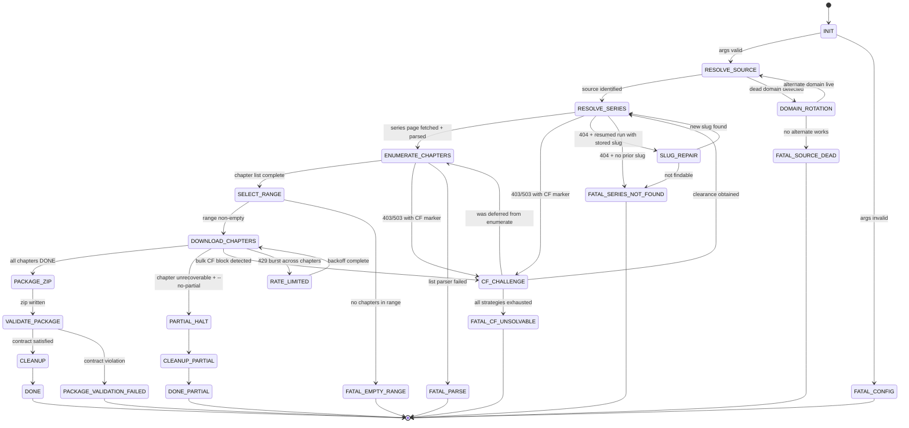
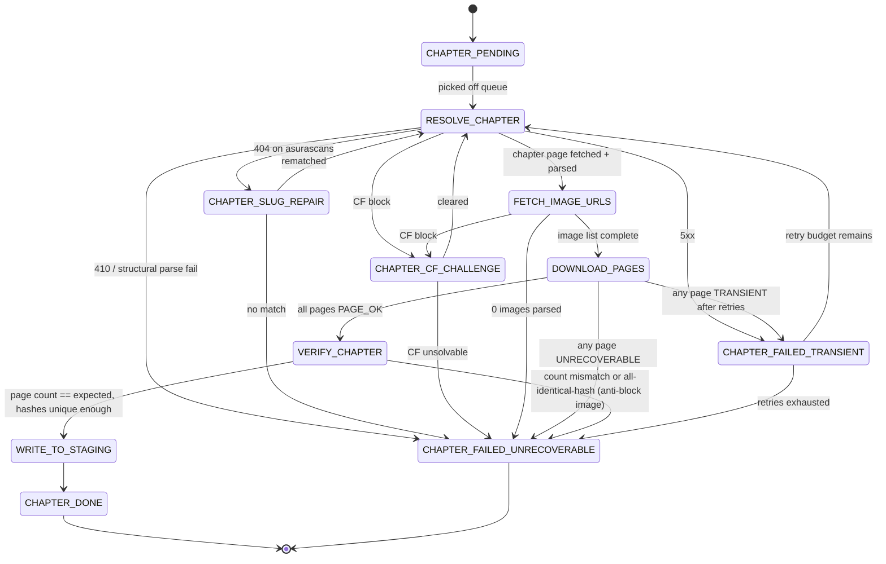
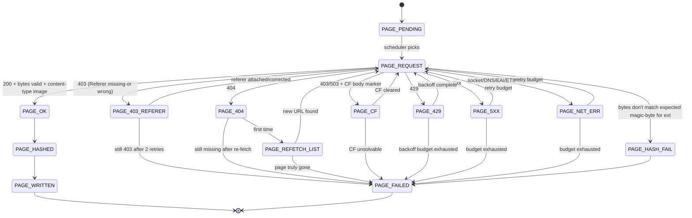
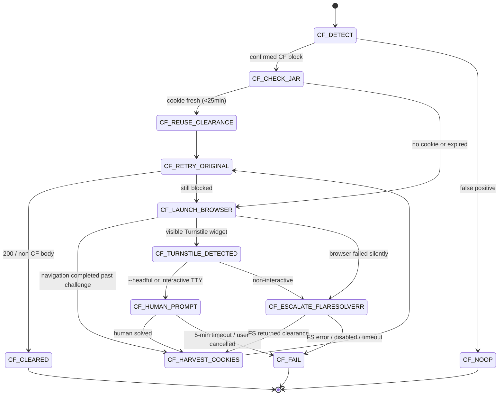
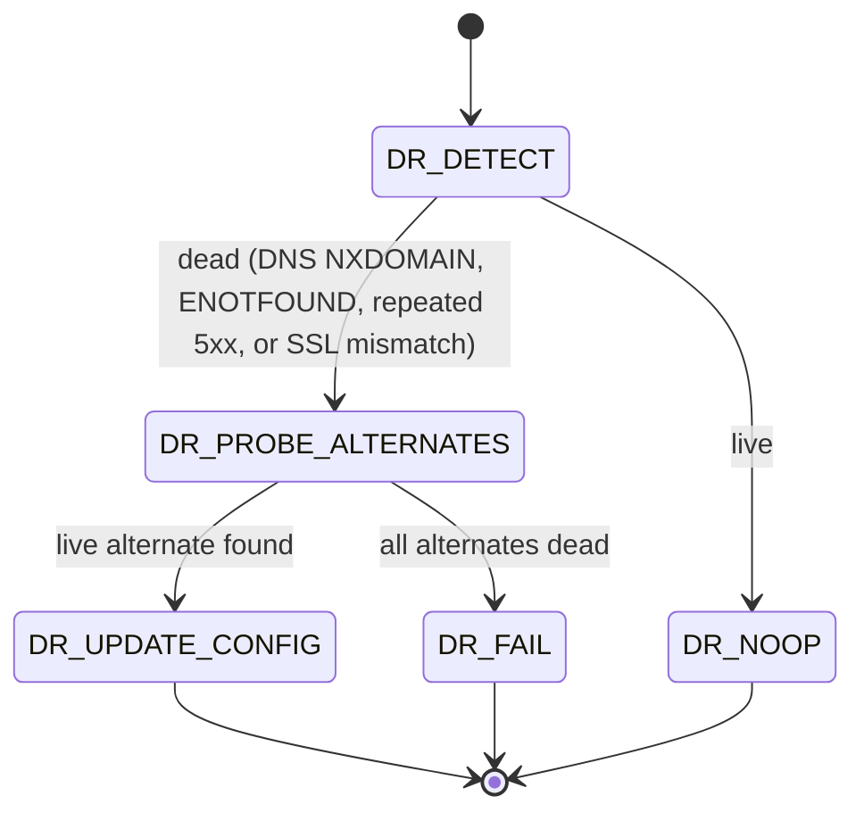
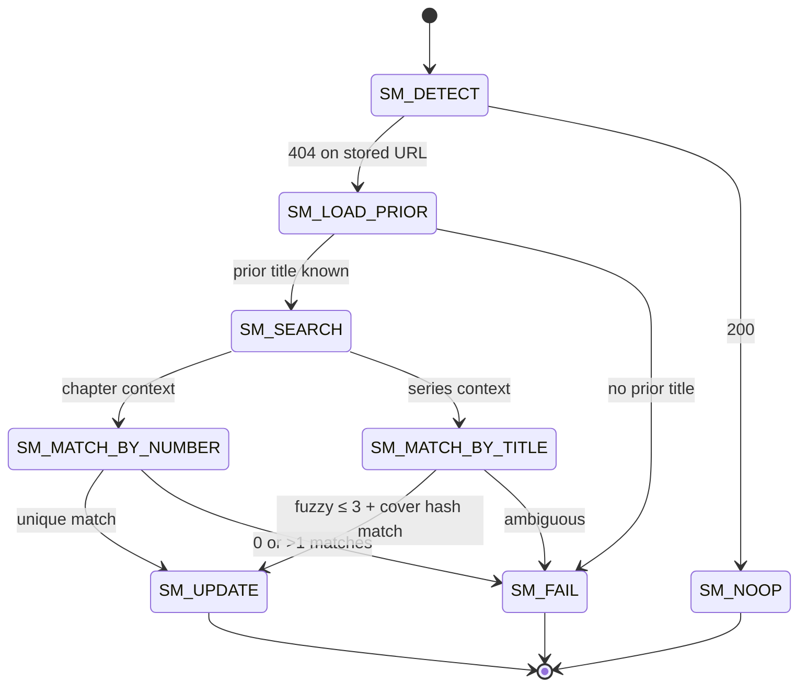

# WORKFLOW: Verreaux Scraper — End-to-End Specification

**Version:** 0.1
**Date:** 2026-05-16
**Author:** Workflow Architect
**Status:** Draft (pending Reality Checker pass once code exists)
**Implements:** `verreaux-scrape` CLI — multi-source manhwa/manga scraper producing Verreaux-compatible ZIPs

---

## 0. Reading guide

This document is **build-ready**. Engineers implement directly from it; QA writes tests against the **events**, **exit codes**, and **state tables**. Every state has:

- a **stable identifier** (`SCREAMING_SNAKE`),
- explicit **entry side-effects**,
- an **exit guard** (the predicate that must hold before transitioning),
- a **success transition** and **all failure transitions**,
- the **observable signal** it emits (event name + log line),
- a **resume marker** (what gets persisted to SQLite so `--resume` can re-enter this state).

Convention: **states** are `UPPER_SNAKE`, **events** are `dot.lower.snake`, **error codes** are `ERR_UPPER_SNAKE`.

---

## 1. Output contract (immutable — derived from `app/src/features/import/zipWalker.ts`)

The scraper produces exactly **one** ZIP per invocation, structured as a **Type 2** import per `detectImportType` (`app/src/features/import/typeDetector.ts`): one top-level series folder, chapter sub-folders inside.

```
<Series Title>/
  cover.webp                       # match: /^cover\.(webp|jpg|jpeg|png)$/i
  Chapter 000/                     # natural-sort key derived from leading digits
    001.webp                       # zero-padded; sort key parsed by extractSortKey
    002.webp
    ...
  Chapter 001/
    ...
```

**Hard constraints (verified against zipWalker + naturalSort):**

1. Series title at root, no leading prefix. Filesystem-illegal characters MUST be replaced before zipping (`\\/:*?"<>|` → `_`); collapse multiple spaces; trim. Series title MUST NOT end with `.` or whitespace on any OS.
2. Cover filename MUST match `/^cover\.(webp|jpg|jpeg|png)$/i`. Exactly one cover per series.
3. Chapter folder name MUST begin with a digit-bearing token whose `extractSortKey` resolves to the canonical chapter number. Pattern: `Chapter NNN` zero-padded to width 3 (or 4 if any chapter ≥ 1000). Decimal chapters use `Chapter NNN.5` — preserved verbatim, since `extractSortKey` reads `\d+(?:\.\d+)?`.
4. Page filename MUST be `NNN.<ext>` zero-padded to width 3 (or 4 if any chapter has ≥1000 pages — defensive). Page numbering starts at **001**.
5. Acceptable image extensions: `.webp .jpg .jpeg .png` (lowercase).
6. ZIP compression: **STORE** (no DEFLATE) — images are already compressed; `adm-zip` `ZIP_STORED`. Cover MAY be DEFLATE-compressed if not WebP/JPEG.
7. No hidden files (`.DS_Store`, `Thumbs.db`, `__MACOSX/`). No empty folders.
8. UTF-8 filenames, ZIP general-purpose bit 11 set.

**Failure to satisfy any of the above** → the run is INVALID and MUST end in `PACKAGE_VALIDATION_FAILED` state with exit code `7`.

---

## 2. Top-level glossary

| Term | Meaning |
|---|---|
| **Run** | One `verreaux-scrape` invocation, identified by `run_id = uuidv7()`. |
| **Source** | One of `asurascans` \| `manhuaplus`. Determined by URL host probe. |
| **Series** | The manhwa/manga being scraped. Has a `series_id` (slug + content hash), `series_url`, `canonical_title`. |
| **Chapter** | One installment. Has `chapter_number` (float), `chapter_url`, `expected_page_count` (post-resolution). |
| **Page** | One image. Has `page_index` (1-based), `image_url`, `referer`, `sha1`, `bytes`, `ext`. |
| **CF clearance** | A `cf_clearance` cookie + UA pair that satisfies Cloudflare for a given host. |
| **Staging dir** | `<out>/.verreaux-stage/<run_id>/` where files are written before packaging. |
| **State DB** | `<out>/.verreaux-stage/state.sqlite` — persistent across runs (cookie jar, run progress). |

---

## 3. CLI surface (decided)

```
verreaux-scrape <series-url>
  [--from <N>]               # inclusive, default = 1
  [--to <M|latest>]          # inclusive, default = latest
  [--out <dir>]              # default ./dist
  [--format <webp|original>] # default webp (transcode to webp if not already)
  [--concurrency <N>]        # image concurrency per chapter, default 3, max 5
  [--resume]                 # resume the most recent matching run for this series_url
  [--flaresolverr <url>]     # default http://localhost:8191
  [--no-flaresolverr]        # disable FlareSolverr fallback
  [--headful]                # show Playwright browser (debug)
  [--cookies-from <path>]    # pre-seed cookie jar from Netscape cookies.txt
  [--log <json|pretty>]      # default pretty, json for CI
  [--dry-run]                # resolve everything but do not download
```

**Argument-validation precedence** (all run inside `INIT` state):
1. URL is well-formed → else exit 2 `ERR_BAD_URL`.
2. URL host is a known source (after probe / alias check) → else exit 4 `ERR_UNKNOWN_SOURCE`.
3. `--from` ≥ 1, `--to` ≥ `--from` (or `latest`) → else exit 2 `ERR_BAD_RANGE`.
4. `--concurrency` in `[1, 5]` → else exit 2 `ERR_BAD_CONCURRENCY`.
5. `--out` writable → else exit 2 `ERR_OUT_NOT_WRITABLE`.

---

## 4. Top-level run lifecycle

### 4.1 State diagram (Mermaid `stateDiagram-v2`)



### 4.2 State table

| State | Entry side-effects | Exit guard | Success transition | Failure transitions | Observable signal | Resume marker |
|---|---|---|---|---|---|---|
| `INIT` | Parse argv; open `state.sqlite`; init logger; create `run_id`; ensure `--out` exists & writable; load cookie jar. | All args validated, DB ready, staging dir created. | `RESOLVE_SOURCE` | → `FATAL_CONFIG` on any validation error. | `run.init` | `runs(run_id, state='INIT')` row written. |
| `RESOLVE_SOURCE` | Parse host of `<series-url>`; match against source registry (incl. known aliases like `asuratoon.com`, `asurascans.com`); probe live domain via HEAD `/`. | Source adapter identified AND domain reachable (HTTP < 500 with HTML body or a known CF body). | `RESOLVE_SERIES` | → `DOMAIN_ROTATION` if probe fails for known-rotating source; → `FATAL_CONFIG` on truly unknown host. | `source.resolved` | `runs.source` set. |
| `DOMAIN_ROTATION` | Iterate alternate-domain list; HEAD probe each; on first live one, update `runs.source_domain`. | One alternate returns 2xx/3xx/CF-challenge body. | `RESOLVE_SOURCE` (re-enter with rewritten URL) | → `FATAL_SOURCE_DEAD` after all alternates exhausted. | `source.domain_rotated` | `runs.source_domain` updated. |
| `RESOLVE_SERIES` | GET `<series-url>` via Playwright (Cloudflare path) OR `got` (already-cleared); parse: title, cover URL, source `post_id` (manhuaplus) / `next_data` (asurascans); compute `series_id`. | Title + cover URL + chapter-list anchor parsed. | `ENUMERATE_CHAPTERS` | → `CF_CHALLENGE` (deferred=RESOLVE_SERIES); → `SLUG_REPAIR` (resume + 404); → `FATAL_SERIES_NOT_FOUND` (cold + 404); → `FATAL_PARSE` (200 but parser failed). | `series.resolved` | `runs.series_id`, `runs.series_title`, `runs.series_post_id` (manhuaplus). |
| `SLUG_REPAIR` | For AsuraScans: load stored series title from prior run; GET search page; find candidate by fuzzy title match (Levenshtein ≤ 3). | Single confident match found. | `RESOLVE_SERIES` (with rewritten URL) | → `FATAL_SERIES_NOT_FOUND` if 0 matches or > 1 ambiguous. | `series.slug_repaired` | `runs.series_url` updated. |
| `ENUMERATE_CHAPTERS` | AsuraScans: read `__NEXT_DATA__` JSON, extract chapter array. ManhuaPlus: POST `admin-ajax.php` action=`manga_get_chapters` body=`manga=<post_id>`, parse returned HTML. | List has ≥1 chapter; each entry has `chapter_number` and `chapter_url`. | `SELECT_RANGE` | → `CF_CHALLENGE` on 403/503; → `FATAL_PARSE` on malformed payload. | `chapters.enumerated` | `chapters` table populated. |
| `SELECT_RANGE` | Apply `--from/--to`; resolve `latest` to max chapter number; filter; sort by `extractSortKey`. | Selected set non-empty. | `DOWNLOAD_CHAPTERS` | → `FATAL_EMPTY_RANGE`. | `range.selected` | `chapters.selected=true`. |
| `DOWNLOAD_CHAPTERS` | For each chapter in order: drive **per-chapter sub-workflow** (§5). Cover downloaded once before first chapter. Bottleneck: 2 req/s per host. | All chapters reach `CHAPTER_DONE` OR a chapter is marked `CHAPTER_FAILED_UNRECOVERABLE`. | `PACKAGE_ZIP` | → `PARTIAL_HALT` when unrecoverable AND default policy is halt; → `CF_CHALLENGE` (deferred=DOWNLOAD_CHAPTERS); → `RATE_LIMITED`. | `download.started`, `download.chapter.done` (per chapter) | `chapters.state` per row. |
| `RATE_LIMITED` | Pause bottleneck; sleep per backoff curve (§13); reduce concurrency by 1 (floor 1). | `Retry-After` elapsed OR jittered backoff complete. | `DOWNLOAD_CHAPTERS` | (no failure transition — RL is always recoverable up to N=6 then escalates as CF). | `rate.limited`, `rate.resumed` | `runs.rl_budget` decremented. |
| `CF_CHALLENGE` | Drive **Cloudflare challenge handler** (§7). Stores `deferred_state` so the FSM knows where to return. | New `cf_clearance` cookie acquired and verified by GET of original URL returning HTML (no CF marker). | back to `deferred_state` | → `FATAL_CF_UNSOLVABLE`. | `cf.detected`, `cf.cleared` | `cookies(host, cf_clearance, ua, fetched_at)`. |
| `PACKAGE_ZIP` | Build the `<Series Title>/` tree from staging; transcode if `--format webp` and source ext ≠ webp; write ZIP with `adm-zip` STORED. | ZIP file written and CRCs verified. | `VALIDATE_PACKAGE` | → `PACKAGE_VALIDATION_FAILED` on IO error. | `package.started`, `package.written` | `runs.zip_path`. |
| `VALIDATE_PACKAGE` | Walk emitted ZIP via the same logic as `app/src/features/import/zipWalker.ts`: assert series folder, cover regex, chapter folders sort correctly, page count per chapter matches `expected_page_count`. | All assertions pass. | `CLEANUP` | → `PACKAGE_VALIDATION_FAILED`. | `validate.ok` or `validate.failed` | `runs.validated=1`. |
| `CLEANUP` | Delete staging dir; vacuum stale rows older than `--retain` days (default 30); flush logs. | Staging dir absent; DB consistent. | `DONE` | (errors here are logged, never fatal — they downgrade to `DONE_WITH_WARNINGS`). | `cleanup.ok` | `runs.state='DONE'`. |
| `PARTIAL_HALT` | Mark the failed chapter; freeze run; refuse to package. | Run state persisted. | `CLEANUP_PARTIAL` | — | `run.partial_halt` | `runs.state='PARTIAL'`. |
| `CLEANUP_PARTIAL` | Preserve staging dir for `--resume`; do not delete state. | DB row marks resumable. | `DONE_PARTIAL` | — | `cleanup.partial` | `runs.state='DONE_PARTIAL'`. |
| Terminal `FATAL_*` | Emit `run.fatal` with code, persist `runs.state`, do not delete staging if resumable. | — | — | — | `run.fatal` | — |

### 4.3 Top-level handoff contracts

**INIT → RESOLVE_SOURCE**
```ts
{
  runId: string,                       // uuidv7
  args: ResolvedArgs,                  // validated, defaults applied
  outDir: string,                      // absolute
  stagingDir: string,                  // absolute, exists
  cookieJar: CookieJarHandle,          // sqlite-backed
  startedAt: string                    // ISO-8601
}
```

**RESOLVE_SOURCE → RESOLVE_SERIES**
```ts
{
  source: 'asurascans' | 'manhuaplus',
  sourceDomain: string,                // e.g. 'asuracomic.net' after rotation
  adapter: SourceAdapter,              // strategy instance
  seriesUrl: string                    // canonicalised
}
```

**RESOLVE_SERIES → ENUMERATE_CHAPTERS**
```ts
{
  seriesId: string,                    // hash(source + slug)
  seriesTitle: string,                 // sanitised, filesystem-safe
  coverUrl: string,
  coverReferer: string,
  sourcePostId?: string,               // manhuaplus only
  nextDataChapters?: ChapterStub[]     // asurascans, pre-parsed
}
```

**ENUMERATE_CHAPTERS → SELECT_RANGE**
```ts
{
  chapters: ChapterStub[]              // sorted by extractSortKey ascending
}

type ChapterStub = {
  chapterNumber: number,               // float; matches extractSortKey rules
  chapterTitle: string | null,         // raw from source, optional
  chapterUrl: string                   // absolute
}
```

**SELECT_RANGE → DOWNLOAD_CHAPTERS**
```ts
{
  selected: ChapterStub[],             // non-empty; in download order
  expectedTotal: number                // count
}
```

**DOWNLOAD_CHAPTERS → PACKAGE_ZIP**
```ts
{
  seriesTitle: string,
  stagingSeriesDir: string,            // <staging>/<Series Title>
  coverFile: { absPath: string, ext: ImgExt },
  chapters: Array<{
    folderName: string,                // 'Chapter NNN'
    chapterNumber: number,
    pages: Array<{ absPath: string, ext: ImgExt, sha1: string, bytes: number }>
  }>
}
```

**PACKAGE_ZIP → VALIDATE_PACKAGE**
```ts
{ zipPath: string, byteSize: number }
```

---

## 5. Per-chapter sub-workflow

### 5.1 State diagram



### 5.2 State table

| State | Entry side-effects | Exit guard | Success transition | Failure transitions | Observable signal | Resume marker |
|---|---|---|---|---|---|---|
| `CHAPTER_PENDING` | Row exists in `chapters` with `state='PENDING'`. | Scheduler dequeues. | `RESOLVE_CHAPTER` | — | `chapter.queued` | `chapters.state='PENDING'` |
| `RESOLVE_CHAPTER` | GET `chapter_url` (append `?style=list` on manhuaplus); set `Referer: series_url`; respect bottleneck. | HTTP 200 + HTML parses as chapter page. | `FETCH_IMAGE_URLS` | → `CHAPTER_CF_CHALLENGE`; → `CHAPTER_SLUG_REPAIR` (asura 404); → `CHAPTER_FAILED_TRANSIENT` (5xx, ETIMEDOUT); → `CHAPTER_FAILED_UNRECOVERABLE` (410, structural). | `chapter.resolve` | `chapters.state='RESOLVING'` |
| `CHAPTER_SLUG_REPAIR` | Re-fetch `RESOLVE_SERIES` chapter list (cached if fresh ≤ 5 min); look up entry with same `chapter_number`; rewrite `chapter_url`. | Match found. | `RESOLVE_CHAPTER` | → `CHAPTER_FAILED_UNRECOVERABLE`. | `chapter.slug_repaired` | `chapters.chapter_url` updated |
| `FETCH_IMAGE_URLS` | Parse images. AsuraScans: image tags inside `<div class="reader-area">` or equivalent — `@src` or `@data-src`. ManhuaPlus: select `.reading-content img`, prefer `@data-src` and strip whitespace; fallback `@src`. De-duplicate by URL while preserving order. | `images.length ≥ 1`. | `DOWNLOAD_PAGES` | → `CHAPTER_FAILED_UNRECOVERABLE` (0 images); → `CHAPTER_CF_CHALLENGE`. | `chapter.images_parsed` (with count) | `pages` table seeded with URLs + indices |
| `DOWNLOAD_PAGES` | Schedule images via Bottleneck with concurrency=`min(--concurrency, 5)`. Each image → **per-image sub-workflow** (§6). Aggregate results. | All pages `PAGE_OK`. | `VERIFY_CHAPTER` | → `CHAPTER_FAILED_TRANSIENT`; → `CHAPTER_FAILED_UNRECOVERABLE`. | `chapter.download.progress` | `pages.state` per row |
| `VERIFY_CHAPTER` | Compute SHA-1 of each page; assert (a) page count == parsed images, (b) at least one unique hash (defends against repeated "blocked" placeholder), (c) every page bytes ≥ 1 KiB unless image dims < 64×64. | All assertions hold. | `WRITE_TO_STAGING` | → `CHAPTER_FAILED_UNRECOVERABLE` with reason. | `chapter.verified` | `chapters.verified=1` |
| `WRITE_TO_STAGING` | Move temp page files into `<staging>/<Series>/Chapter NNN/NNN.<ext>`; rename atomically; flush; fsync directory. | All files in place; directory listing matches expected names. | `CHAPTER_DONE` | (IO error → `CHAPTER_FAILED_TRANSIENT`). | `chapter.staged` | `chapters.state='STAGED'` |
| `CHAPTER_DONE` | Emit completion event with timing/bytes. | — | — | — | `chapter.done` | `chapters.state='DONE'` |
| `CHAPTER_FAILED_TRANSIENT` | Increment `chapters.attempts`. | `attempts ≤ 3`. | `RESOLVE_CHAPTER` (after exponential backoff: 5s, 20s, 60s) | → `CHAPTER_FAILED_UNRECOVERABLE`. | `chapter.transient_fail` | `chapters.attempts` |
| `CHAPTER_CF_CHALLENGE` | Delegate to §7. On return, retry the state that triggered it. | Clearance reacquired. | back to `RESOLVE_CHAPTER` or `FETCH_IMAGE_URLS` | → `CHAPTER_FAILED_UNRECOVERABLE`. | `chapter.cf_challenge` | `chapters.cf_attempts` |
| `CHAPTER_FAILED_UNRECOVERABLE` | Persist failure reason; bubble up to `DOWNLOAD_CHAPTERS`. | — | — | — | `chapter.failed` | `chapters.state='FAILED'`, `chapters.error_code` |

### 5.3 Chapter handoff contracts

**RESOLVE_CHAPTER → FETCH_IMAGE_URLS**
```ts
{
  chapterNumber: number,
  chapterUrl: string,                  // final, post-redirect
  pageHtml: string,                    // for parser; never re-fetched
  referer: string                      // = chapterUrl (for image GETs)
}
```

**FETCH_IMAGE_URLS → DOWNLOAD_PAGES**
```ts
{
  chapterNumber: number,
  pages: Array<{
    pageIndex: number,                 // 1-based, dense
    imageUrl: string,
    referer: string                    // chapterUrl on manhuaplus; chapterUrl on asura too
  }>,
  expectedPageCount: number
}
```

**DOWNLOAD_PAGES → VERIFY_CHAPTER**
```ts
{
  chapterNumber: number,
  pageFiles: Array<{
    pageIndex: number,
    tempPath: string,                  // <staging>/.tmp/<sha1>.<ext>
    ext: '.webp' | '.jpg' | '.jpeg' | '.png',
    bytes: number,
    sha1: string
  }>
}
```

**VERIFY_CHAPTER → WRITE_TO_STAGING**
```ts
{ chapterNumber: number, verifiedPages: PageFile[] }
```

---

## 6. Per-image sub-workflow

### 6.1 State diagram



### 6.2 State table

| State | Entry side-effects | Exit guard | Success transition | Failure transitions | Observable signal | Resume marker |
|---|---|---|---|---|---|---|
| `PAGE_PENDING` | Row in `pages` with `state='PENDING'`. | Scheduler picks. | `PAGE_REQUEST` | — | `page.queued` | `pages.state='PENDING'` |
| `PAGE_REQUEST` | `got` GET with: `Referer: <chapterUrl>`, `User-Agent: <harvested>`, cookies from jar, gzip on, 30s total / 10s connect / 30s socket. Stream to `<staging>/.tmp/<rand>.partial`. | HTTP 200 + Content-Type starts with `image/` + bytes ≥ 1 KiB + first 12 bytes match a known magic. | `PAGE_OK` | per status / network class below. | `page.request`, `page.bytes` | `pages.attempts` |
| `PAGE_403_REFERER` | Verify `Referer` header. If header was missing for image host (`gg.asuracomic.net` etc.), set chapter URL as referer. | Referer is correctly chapterUrl. | `PAGE_REQUEST` | → `PAGE_FAILED` after 2 retries. | `page.403_referer` | `pages.attempts` |
| `PAGE_404` | Mark URL stale. | first occurrence. | `PAGE_REFETCH_LIST` | — | `page.404` | `pages.refetched=1` |
| `PAGE_REFETCH_LIST` | Re-execute `FETCH_IMAGE_URLS` for parent chapter; look up `pageIndex` → new URL. | New URL discovered and differs from old. | `PAGE_REQUEST` | → `PAGE_FAILED`. | `page.list_refetched` | `pages.image_url` |
| `PAGE_CF` | Defer to §7 keyed on image host. | Clearance obtained for image host. | `PAGE_REQUEST` | → `PAGE_FAILED`. | `page.cf` | shared cookie jar |
| `PAGE_429` | Read `Retry-After` if present; sleep `max(retryAfter, 2^attempts * 1s + jitter)`. | sleep complete; budget ≥ 1. | `PAGE_REQUEST` | → `PAGE_FAILED`. | `page.429` | `pages.attempts` |
| `PAGE_5XX` | Exponential backoff: 1s, 4s, 16s, 60s (cap). | budget ≥ 1. | `PAGE_REQUEST` | → `PAGE_FAILED`. | `page.5xx` | `pages.attempts` |
| `PAGE_NET_ERR` | Same backoff as 5xx. | budget ≥ 1. | `PAGE_REQUEST` | → `PAGE_FAILED`. | `page.net_err` (with errno) | `pages.attempts` |
| `PAGE_HASH_FAIL` | Delete partial; mark image suspicious. | — | — | → `PAGE_FAILED`. | `page.hash_fail` | `pages.error_code='ERR_BAD_MAGIC'` |
| `PAGE_OK` | File renamed from `.partial` to `<sha1>.<ext>`. | — | `PAGE_HASHED` | — | `page.ok` | `pages.tmp_path` |
| `PAGE_HASHED` | Compute SHA-1 streamed; assert size > 0. If sha1 already in `pages` for this chapter → dedup warning but not failure. | hash recorded. | `PAGE_WRITTEN` | — | `page.hashed` | `pages.sha1` |
| `PAGE_WRITTEN` | Final atomic move occurs in `WRITE_TO_STAGING` (§5). Until then, file stays in `.tmp/`. | — | — | — | `page.done` | `pages.state='DONE'` |
| `PAGE_FAILED` | Persist `error_code` and reason. Bubble to chapter. | — | — | — | `page.failed` | `pages.state='FAILED'` |

### 6.3 Page request shape (decided)

```http
GET <imageUrl> HTTP/1.1
Host: <imageHost>
User-Agent: <UA harvested with cf_clearance>
Accept: image/webp,image/apng,image/svg+xml,image/*,*/*;q=0.8
Accept-Language: en-US,en;q=0.9
Accept-Encoding: gzip, deflate, br
Referer: <chapterUrl>            # MUST be present for asura gg.asuracomic.net
Cookie: <jar entries for host>
Sec-Fetch-Site: cross-site
Sec-Fetch-Mode: no-cors
Sec-Fetch-Dest: image
```

**Magic-byte check (PAGE_REQUEST exit guard):**

| Ext | First bytes |
|---|---|
| `.webp` | `52 49 46 46 .. .. .. .. 57 45 42 50` (`RIFF…WEBP`) |
| `.jpg`/`.jpeg` | `FF D8 FF` |
| `.png` | `89 50 4E 47 0D 0A 1A 0A` |

If `Content-Type` says one extension but magic says another, **trust the magic** and rename. If magic matches none → `PAGE_HASH_FAIL`.

### 6.4 Page handoff contract

**PAGE_REQUEST → PAGE_OK**
```ts
{
  pageIndex: number,
  tempPath: string,                    // <staging>/.tmp/<uuid>.partial → renamed to <sha1>.<ext>
  bytes: number,
  contentType: string,
  detectedExt: '.webp' | '.jpg' | '.jpeg' | '.png',
  responseHeaders: Record<string,string> // logged at debug
}
```

---

## 7. Cloudflare challenge handler state machine

A single shared handler is keyed on **host** (not on requesting state). The deferred state (e.g. `RESOLVE_SERIES`) waits until this handler returns success or fatal.

### 7.1 State diagram



### 7.2 State table

| State | Entry side-effects | Exit guard | Success transition | Failure transitions | Observable signal | Resume marker |
|---|---|---|---|---|---|---|
| `CF_DETECT` | Inspect response: status `403\|503` AND body matches `/Cloudflare\|cf-mitigated\|__cf_chl\|Just a moment/` AND headers contain `cf-mitigated` or `server: cloudflare`. | block confirmed. | `CF_CHECK_JAR` | → `CF_NOOP` (false positive — caller treats as ordinary error). | `cf.detected` | — |
| `CF_CHECK_JAR` | Query `cookies` table for `(host, cf_clearance)` rows where `fetched_at > now-25min`. | cookie found AND not previously failed in this run. | `CF_REUSE_CLEARANCE` | → `CF_LAUNCH_BROWSER`. | `cf.jar_checked` | — |
| `CF_REUSE_CLEARANCE` | Attach cookie + matching UA to `got` agent. | request prepared. | `CF_RETRY_ORIGINAL` | — | `cf.reuse` | — |
| `CF_RETRY_ORIGINAL` | Re-execute the **original failing request** (not the handler's URL — important). | 200 / non-CF body. | `CF_CLEARED` | → `CF_LAUNCH_BROWSER` (mark this jar entry as stale). | `cf.retry` | — |
| `CF_LAUNCH_BROWSER` | Spawn `playwright-extra` Chromium with stealth plugin; set viewport 1280×800; UA from a rotating realistic pool; navigate to host root, wait for `domcontentloaded`; wait up to 30s for selector `body:not(:has(#challenge-form))`. | Page navigated past challenge AND target HTML present. | `CF_HARVEST_COOKIES` | → `CF_TURNSTILE_DETECTED`; → `CF_ESCALATE_FLARESOLVERR`. | `cf.browser_launch` | — |
| `CF_TURNSTILE_DETECTED` | Presence of `iframe[src*='challenges.cloudflare.com']` or `.cf-turnstile`. | — | If `--headful` AND TTY: `CF_HUMAN_PROMPT`; else `CF_ESCALATE_FLARESOLVERR`. | — | `cf.turnstile` | — |
| `CF_HUMAN_PROMPT` | Stdout: "Cloudflare Turnstile detected. Solve the puzzle in the visible browser window. Press ENTER when done (5min timeout)." | User confirms OR timeout. | `CF_HARVEST_COOKIES` | → `CF_FAIL` on timeout/cancel. | `cf.human_prompt` | — |
| `CF_HARVEST_COOKIES` | Read all cookies for host from browser context; extract `cf_clearance`, `__cf_bm`; record UA; upsert into `cookies` table; close browser. | cookie + UA stored. | `CF_RETRY_ORIGINAL` | — | `cf.harvested` | `cookies` row |
| `CF_ESCALATE_FLARESOLVERR` | POST `http://localhost:8191/v1` `{"cmd":"request.get","url":"<host root>","maxTimeout":60000}`. | response `status:'ok'` with cookies + ua. | `CF_HARVEST_COOKIES` (write FS response into jar) | → `CF_FAIL` on error/disabled/timeout. | `cf.fs_call`, `cf.fs_ok` / `cf.fs_fail` | — |
| `CF_CLEARED` | Bubble result up. | — | — | — | `cf.cleared` | `cookies.last_used` |
| `CF_FAIL` | Bubble fatal up to deferred state which becomes `FATAL_CF_UNSOLVABLE`. | — | — | — | `cf.fail` | — |

### 7.3 CF handler contracts

**CF handler input:**
```ts
{
  host: string,                        // 'asuracomic.net'
  originalRequest: {
    method: 'GET' | 'POST',
    url: string,
    headers: Record<string,string>,
    body?: string
  },
  reason: 'status_403' | 'status_503' | 'body_marker',
  attemptBudget: number                // default 3
}
```

**CF handler output (success):**
```ts
{
  ok: true,
  cookies: Array<{ name: string, value: string, domain: string, path: string, expires: number }>,
  userAgent: string,
  retriedRequestBody: Buffer | string  // body of the original retried successfully
}
```

**CF handler output (failure):**
```ts
{ ok: false, code: 'ERR_CF_UNSOLVABLE' | 'ERR_FS_UNAVAILABLE' | 'ERR_TURNSTILE_TIMEOUT', retryable: false }
```

---

## 8. Resume / idempotency

### 8.1 What is persisted (SQLite — `state.sqlite`)

```sql
CREATE TABLE runs (
  run_id TEXT PRIMARY KEY,
  series_url TEXT NOT NULL,
  series_id TEXT,
  series_title TEXT,
  source TEXT,
  source_domain TEXT,
  series_post_id TEXT,
  args_json TEXT NOT NULL,
  state TEXT NOT NULL,                  -- last reached state
  zip_path TEXT,
  started_at TEXT NOT NULL,
  updated_at TEXT NOT NULL,
  finished_at TEXT,
  exit_code INTEGER,
  validated INTEGER DEFAULT 0,
  rl_budget INTEGER DEFAULT 6
);

CREATE TABLE chapters (
  run_id TEXT NOT NULL,
  chapter_number REAL NOT NULL,
  chapter_url TEXT NOT NULL,
  chapter_title TEXT,
  selected INTEGER DEFAULT 0,
  state TEXT NOT NULL DEFAULT 'PENDING',
  attempts INTEGER DEFAULT 0,
  cf_attempts INTEGER DEFAULT 0,
  verified INTEGER DEFAULT 0,
  error_code TEXT,
  error_reason TEXT,
  expected_page_count INTEGER,
  PRIMARY KEY (run_id, chapter_number),
  FOREIGN KEY (run_id) REFERENCES runs(run_id)
);

CREATE TABLE pages (
  run_id TEXT NOT NULL,
  chapter_number REAL NOT NULL,
  page_index INTEGER NOT NULL,
  image_url TEXT NOT NULL,
  referer TEXT NOT NULL,
  sha1 TEXT,
  bytes INTEGER,
  ext TEXT,
  tmp_path TEXT,
  state TEXT NOT NULL DEFAULT 'PENDING',
  attempts INTEGER DEFAULT 0,
  error_code TEXT,
  error_reason TEXT,
  PRIMARY KEY (run_id, chapter_number, page_index)
);

CREATE TABLE cookies (
  host TEXT NOT NULL,
  name TEXT NOT NULL,
  value TEXT NOT NULL,
  domain TEXT NOT NULL,
  path TEXT NOT NULL,
  expires INTEGER,
  user_agent TEXT NOT NULL,
  fetched_at TEXT NOT NULL,
  last_used TEXT,
  stale INTEGER DEFAULT 0,
  PRIMARY KEY (host, name)
);

CREATE TABLE run_events (
  run_id TEXT NOT NULL,
  ts TEXT NOT NULL,
  event TEXT NOT NULL,
  payload_json TEXT NOT NULL
);
```

### 8.2 Resumable vs. must-restart

| Reached state | `--resume` behavior |
|---|---|
| `DONE`, `DONE_PARTIAL` | New run created; previous run untouched. |
| `FATAL_CONFIG`, `FATAL_EMPTY_RANGE` | Cannot resume — re-invoke with fixed args. |
| `FATAL_SOURCE_DEAD` | Resume retries `DOMAIN_ROTATION` first. |
| `FATAL_SERIES_NOT_FOUND` | Resume retries `RESOLVE_SERIES` then `SLUG_REPAIR`. |
| `FATAL_CF_UNSOLVABLE` | Resume retries CF subsystem from scratch with fresh browser launch. |
| `FATAL_PARSE` | Resume retries — useful if site structure changed and adapter was patched. |
| `PARTIAL_HALT` / `DONE_PARTIAL` | Resume continues from first non-`DONE` chapter; preserves staging. |
| Mid-state crash (no terminal row) | Resume re-enters last persisted state; idempotent operations rerun safely. |

### 8.3 Idempotency rules per state

- **RESOLVE_SOURCE / RESOLVE_SERIES / ENUMERATE_CHAPTERS / SELECT_RANGE**: always safe to re-run. Outputs overwrite the row in `runs` / `chapters`.
- **DOWNLOAD_CHAPTERS**: skips any chapter where `state='DONE'`. For `PARTIAL` chapters (some pages DONE, some not), retains DONE pages, retries others. SHA-1 of any retried page is compared with stored value — mismatch logs `page.sha1_drift` but the **new** bytes win (covers genuine content updates).
- **WRITE_TO_STAGING**: atomic rename + fsync. If interrupted, partial files remain in `.tmp/` and are GC'd on next start.
- **PACKAGE_ZIP**: deterministic — same inputs → identical ZIP (sorted entries, fixed mtime per chapter folder). Re-runs overwrite.
- **VALIDATE_PACKAGE**: pure read.
- **CLEANUP**: refuses to delete if run is `PARTIAL` or any chapter not `DONE`.

### 8.4 SHA-1 dedup interaction with retries

- SHA-1 is computed in `PAGE_HASHED` and stored.
- If the same image URL is retried (e.g. `PAGE_REFETCH_LIST` returned an updated URL), we compute the new SHA-1 and compare. **A mismatch is not a failure** — it triggers a `page.sha1_drift` warning event and the new file replaces the old.
- Within a chapter, **all-pages-identical-hash** is a strong "anti-bot placeholder" signal → `VERIFY_CHAPTER` fails.
- Across runs (resume), if SHA-1 of a DONE page survives, the file is reused and the network request is skipped entirely. This is the primary resume optimization.

---

## 9. Domain-rotation handler

### 9.1 State diagram



### 9.2 Source aliases (initial known set — adapter-supplied)

| Source | Live (2026-05) | Historical aliases probed in order |
|---|---|---|
| AsuraScans | `asuracomic.net` | `asurascans.com`, `asuratoon.com`, `asura.gg`, `asurascans.gg` |
| ManhuaPlus | `manhuaplus.org` | `manhuaplus.com`, `manhuaplus.net` |

### 9.3 State table

| State | Entry side-effects | Exit guard | Success transition | Failure transitions | Observable signal | Resume marker |
|---|---|---|---|---|---|---|
| `DR_DETECT` | Probe `HEAD https://<host>/` with 8s timeout; classify dead if: DNS error, repeated connection refused, repeated 5xx, certificate-host mismatch. | classification done. | `DR_PROBE_ALTERNATES` if dead, else `DR_NOOP`. | — | `source.probe` | — |
| `DR_PROBE_ALTERNATES` | For each alternate (in order): HEAD; if 2xx/3xx/CF body, accept. | one passes. | `DR_UPDATE_CONFIG` | → `DR_FAIL` (all dead). | `source.alt_probe` | — |
| `DR_UPDATE_CONFIG` | Rewrite `seriesUrl` to use new domain; persist `runs.source_domain`; emit warning. | seriesUrl rewritten. | — | — | `source.domain_rotated` | `runs.source_domain` |
| `DR_FAIL` | bubble to `FATAL_SOURCE_DEAD`. | — | — | — | `source.dead` | — |

---

## 10. Slug-mutation handler (AsuraScans-specific)

AsuraScans appends a random hash to series slugs (e.g. `solo-leveling-arise-abc123`). Editing the title rotates the hash, breaking previously-stored URLs. This handler recovers.

### 10.1 State diagram



### 10.2 State table

| State | Entry side-effects | Exit guard | Success transition | Failure transitions | Observable signal | Resume marker |
|---|---|---|---|---|---|---|
| `SM_DETECT` | Caller observes 404 from `RESOLVE_SERIES` or `RESOLVE_CHAPTER`. | — | `SM_LOAD_PRIOR` | `SM_NOOP` if not a 404. | `slug.detect` | — |
| `SM_LOAD_PRIOR` | Read `runs` for matching prior series_url → series_title. | title known. | `SM_SEARCH` | `SM_FAIL`. | — | — |
| `SM_SEARCH` | For series context: GET `https://asuracomic.net/?s=<encoded title>`. For chapter context: re-do `RESOLVE_SERIES` (which may itself recurse into series-level repair) then look up by chapter_number. | search page parsed. | `SM_MATCH_*` | `SM_FAIL`. | `slug.search` | — |
| `SM_MATCH_BY_NUMBER` | Filter chapter list for `chapter_number` equality (epsilon 1e-6). | exactly 1 match. | `SM_UPDATE` | `SM_FAIL`. | — | — |
| `SM_MATCH_BY_TITLE` | Compute Levenshtein on candidate titles vs. stored title; reject if best ≥ 4 or top-2 within 1. Optional: download candidate cover and compare perceptual hash to stored cover. | confident. | `SM_UPDATE` | `SM_FAIL`. | — | — |
| `SM_UPDATE` | Rewrite stored URL; emit warning. | URL replaced. | — | — | `slug.repaired` | `runs.series_url` / `chapters.chapter_url` |
| `SM_FAIL` | bubble to fatal. | — | — | — | `slug.fail` | — |

### 10.3 Contract

**Input:**
```ts
{ context: 'series' | 'chapter', deadUrl: string, priorTitle?: string, chapterNumber?: number }
```
**Output (success):**
```ts
{ ok: true, repairedUrl: string, matchedTitle: string, similarity: number }
```
**Output (failure):**
```ts
{ ok: false, code: 'ERR_SLUG_NO_MATCH' | 'ERR_SLUG_AMBIGUOUS' | 'ERR_SLUG_NO_PRIOR' }
```

---

## 11. Rate-limit / 429 handler

Applies at three levels: per-image, per-chapter (aggregate of pages), per-run.

### 11.1 Backoff curve

| Trigger | Strategy |
|---|---|
| `Retry-After: <n>` present | sleep exactly `n` seconds + 250ms jitter. |
| Retry-After absent | exponential: `2^attempt * 1s` capped at 60s; jitter ±25%. |
| Concurrent 429s ≥ 3 in 30s | drop bottleneck concurrency by 1 (floor 1); halve req/s rate for 5 min then linearly recover. |
| 429 budget exhausted (`runs.rl_budget=0`) | escalate as `CF_DETECT` (some sites mask CF as 429). |

### 11.2 State table

| State | Entry side-effects | Exit guard | Success transition | Failure transitions | Observable signal | Resume marker |
|---|---|---|---|---|---|---|
| `RL_DETECT` | HTTP 429 observed at request layer. | — | `RL_BACKOFF` | — | `rate.detect` | — |
| `RL_BACKOFF` | Compute sleep per §11.1; pause Bottleneck reservoir; log countdown. | sleep complete. | `RL_ADJUST_THROTTLE` | — | `rate.backoff` | `runs.rl_budget` |
| `RL_ADJUST_THROTTLE` | If burst-trigger met (§11.1 row 3), reduce concurrency and rate; emit new settings. | settings applied. | back to caller (PAGE_REQUEST etc.) | — | `rate.throttle_adjusted` | — |
| `RL_EXHAUSTED` | `rl_budget = 0`. | — | — | — | `rate.exhausted` | — |

After exhaustion the caller treats as `CF_DETECT` to retry with a fresh browser identity.

---

## 12. Failure-mode matrix (cross-cutting)

| Trigger | Detection | Recovery strategy | Max retries | Backoff | User message | Exit code if unrecoverable |
|---|---|---|---|---|---|---|
| Malformed `<series-url>` | URL parse in `INIT` | none | 0 | — | "Invalid series URL: <reason>." | 2 |
| Unknown source host | source registry miss after probe | none | 0 | — | "Source not supported. Known: asurascans, manhuaplus." | 4 |
| `--from > --to` | INIT validation | none | 0 | — | "Empty chapter range." | 2 |
| `--out` not writable | INIT `fs.access W_OK` | none | 0 | — | "Cannot write to <out>." | 2 |
| Source domain dead (DNS / repeated 5xx) | `DR_DETECT` | rotate via alternates list | 1 per alt | 0 | "Source domain dead; rotated to <new>." | 4 if all dead |
| Cloudflare 403/503 | body marker + status | CF handler §7 | 3 | per §7 | "Cloudflare challenge solved." or "Cloudflare cannot be bypassed." | 3 |
| Cloudflare Turnstile, non-interactive | DOM detect | escalate to FlareSolverr or fail | 1 | 0 | "Manual Turnstile required — re-run with --headful." | 3 |
| FlareSolverr unavailable | HTTP error to localhost:8191 | none | 1 | 2s | "FlareSolverr unreachable; rerun with --headful or start FS." | 3 |
| 404 on series URL (cold) | RESOLVE_SERIES | none | 0 | — | "Series not found." | 4 |
| 404 on series URL (resume) | RESOLVE_SERIES + prior data | `SLUG_REPAIR` | 1 | 0 | "Slug rotated; updated to <new>." | 4 |
| 404 on chapter URL | RESOLVE_CHAPTER | re-enumerate + rematch by number | 1 | 0 | "Chapter <N> URL repaired." | 5 if chapter unrecoverable |
| 410 Gone on chapter | header | none | 0 | — | "Chapter <N> removed at source." | 5 (partial) |
| 5xx on any request | status | exp backoff | 4 | 1/4/16/60s | "Transient server error; retrying." | 1 |
| Network timeout / ETIMEDOUT / ENOTFOUND | got / undici error class | exp backoff | 4 | 1/4/16/60s | "Network error; retrying." | 1 |
| 429 with Retry-After | header | sleep + retry | 6 per run | per §11 | "Rate limited; sleeping <n>s." | 3 (after exhaustion → CF) |
| 429 burst | 3 in 30s | reduce concurrency | — | — | "Throttle reduced to <n>." | — |
| 403 on image (Referer missing) | status + jar | attach correct Referer | 2 | 0 | (debug only) | 5 if persists |
| 403 on image (post-CF) | status post-CF retry | drop jar entry, re-CF | 2 | 0 | "Image still 403 after CF clear." | 5 |
| Image content-type mismatch | header vs. magic | trust magic, rename | 0 | 0 | (debug warning) | — |
| Image bytes < 1 KiB | size after stream | retry once | 1 | 2s | "Suspicious tiny image; retried." | 5 |
| All chapter pages identical SHA-1 | VERIFY_CHAPTER | mark chapter failed | 0 | — | "Source returned placeholder images for chapter <N>." | 5 |
| ENUMERATE returns 0 chapters | parser | re-fetch series once | 1 | 5s | "No chapters found." | 4 |
| Parser exception (unknown HTML shape) | try/catch in adapter | none | 0 | — | "Adapter parser failed; please file an issue with sample." | 6 |
| `adm-zip` write error / disk full | fs error | none | 0 | — | "Failed to write ZIP: <reason>." | 1 |
| `VALIDATE_PACKAGE` contract violation | walker mismatch | none | 0 | — | "Internal: produced ZIP failed contract — <which>." | 7 |
| User SIGINT (Ctrl-C) | process signal | flush DB, persist state | — | — | "Interrupted; state saved. Use --resume to continue." | 130 |
| Process killed (SIGKILL / OOM) | next start sees stale `runs.state` | resume from last persisted state | — | — | "Crash recovered." | — |
| Cookie jar corruption | sqlite open error | back up + recreate | 1 | 0 | "Cookie jar corrupt; reinitialised." | — |
| Insufficient inodes / disk | EIO during stage | none | 0 | — | "Disk full." | 1 |

### Exit code table

| Code | Name | Meaning |
|---|---|---|
| 0 | `OK` | All selected chapters downloaded, packaged, validated. |
| 1 | `GENERIC` | Unclassified error; check logs. |
| 2 | `CONFIG` | Bad CLI args / unwritable out / bad range. |
| 3 | `AUTH_CF` | Cloudflare/auth cannot be bypassed. |
| 4 | `SOURCE_NOT_FOUND` | Source dead, series missing, or unknown host. |
| 5 | `PARTIAL` | Some chapters downloaded but not all; resume possible. |
| 6 | `PARSER` | Adapter parser failed — source structure changed. |
| 7 | `PACKAGE_INVALID` | Internal — produced ZIP violates output contract. |
| 130 | `INTERRUPTED` | SIGINT (Ctrl-C). |

---

## 13. Global event taxonomy

Events are emitted to:
1. stdout if `--log pretty` (formatted) or `--log json` (NDJSON).
2. `run_events` table.
3. (debug) `<out>/.verreaux-stage/<run_id>/events.ndjson`.

Every event payload is wrapped:

```ts
type Envelope<T> = {
  ts: string,                          // ISO-8601 with ms
  runId: string,
  level: 'debug' | 'info' | 'warn' | 'error',
  state: string,                       // current state name
  event: string,                       // dot.snake name
  payload: T
}
```

### 13.1 Lifecycle

| Event | Level | Payload |
|---|---|---|
| `run.init` | info | `{ args, version, nodeVersion, pid }` |
| `run.resumed` | info | `{ priorRunId, fromState }` |
| `run.partial_halt` | warn | `{ reason, lastChapter }` |
| `run.fatal` | error | `{ code, message, state }` |
| `run.done` | info | `{ zipPath, chapterCount, bytes, elapsedMs, exitCode }` |

### 13.2 Source / domain

| Event | Level | Payload |
|---|---|---|
| `source.resolved` | info | `{ source, sourceDomain }` |
| `source.probe` | debug | `{ host, status, ms }` |
| `source.alt_probe` | debug | `{ tried, result }` |
| `source.domain_rotated` | warn | `{ from, to }` |
| `source.dead` | error | `{ host }` |

### 13.3 Series / slug

| Event | Level | Payload |
|---|---|---|
| `series.resolved` | info | `{ seriesId, seriesTitle, coverUrl, postId? }` |
| `slug.detect` | debug | `{ deadUrl }` |
| `slug.search` | debug | `{ query, candidates }` |
| `slug.repaired` | warn | `{ from, to, similarity }` |
| `slug.fail` | error | `{ deadUrl, reason }` |

### 13.4 Chapter / pages

| Event | Level | Payload |
|---|---|---|
| `chapters.enumerated` | info | `{ total }` |
| `range.selected` | info | `{ from, to, count }` |
| `download.started` | info | `{ count, concurrency }` |
| `chapter.queued` | debug | `{ chapterNumber }` |
| `chapter.resolve` | debug | `{ chapterNumber, url }` |
| `chapter.slug_repaired` | warn | `{ chapterNumber, from, to }` |
| `chapter.images_parsed` | debug | `{ chapterNumber, pageCount }` |
| `chapter.download.progress` | debug | `{ chapterNumber, done, total, bytes }` |
| `chapter.verified` | debug | `{ chapterNumber }` |
| `chapter.staged` | debug | `{ chapterNumber, folder }` |
| `chapter.done` | info | `{ chapterNumber, pageCount, bytes, elapsedMs }` |
| `chapter.transient_fail` | warn | `{ chapterNumber, attempts, reason }` |
| `chapter.cf_challenge` | debug | `{ chapterNumber }` |
| `chapter.failed` | error | `{ chapterNumber, code, reason }` |
| `page.queued` | debug | `{ chapterNumber, pageIndex }` |
| `page.request` | debug | `{ chapterNumber, pageIndex, url }` |
| `page.bytes` | debug | `{ chapterNumber, pageIndex, bytes, contentType }` |
| `page.ok` | debug | `{ chapterNumber, pageIndex, sha1, ext }` |
| `page.hashed` | debug | `{ chapterNumber, pageIndex, sha1 }` |
| `page.403_referer` | debug | `{ chapterNumber, pageIndex }` |
| `page.404` | warn | `{ chapterNumber, pageIndex, url }` |
| `page.list_refetched` | warn | `{ chapterNumber, pageIndex, oldUrl, newUrl }` |
| `page.cf` | debug | `{ chapterNumber, pageIndex, host }` |
| `page.429` | warn | `{ chapterNumber, pageIndex, retryAfter }` |
| `page.5xx` | warn | `{ chapterNumber, pageIndex, status }` |
| `page.net_err` | warn | `{ chapterNumber, pageIndex, errno, syscall }` |
| `page.hash_fail` | error | `{ chapterNumber, pageIndex, reason }` |
| `page.sha1_drift` | warn | `{ chapterNumber, pageIndex, oldSha1, newSha1 }` |
| `page.failed` | error | `{ chapterNumber, pageIndex, code, reason }` |
| `page.done` | debug | `{ chapterNumber, pageIndex }` |

### 13.5 CF / rate / package

| Event | Level | Payload |
|---|---|---|
| `cf.detected` | warn | `{ host, reason, status }` |
| `cf.jar_checked` | debug | `{ host, hit }` |
| `cf.reuse` | debug | `{ host, ageMs }` |
| `cf.retry` | debug | `{ url, status }` |
| `cf.browser_launch` | info | `{ host, headful }` |
| `cf.turnstile` | warn | `{ host }` |
| `cf.human_prompt` | info | `{ host, timeoutSec }` |
| `cf.harvested` | info | `{ host, cookieNames }` |
| `cf.fs_call` | debug | `{ url }` |
| `cf.fs_ok` | info | `{ url }` |
| `cf.fs_fail` | error | `{ url, reason }` |
| `cf.cleared` | info | `{ host }` |
| `cf.fail` | error | `{ host, code }` |
| `rate.detect` | warn | `{ host, retryAfter }` |
| `rate.backoff` | warn | `{ host, sleepMs }` |
| `rate.throttle_adjusted` | warn | `{ newConcurrency, newRatePerSec }` |
| `rate.exhausted` | error | `{ host }` |
| `package.started` | info | `{ chapterCount }` |
| `package.written` | info | `{ zipPath, bytes }` |
| `validate.ok` | info | `{ zipPath, chapterCount, pageCount }` |
| `validate.failed` | error | `{ zipPath, violations }` |
| `cleanup.ok` | info | `{ stagingDir }` |
| `cleanup.partial` | warn | `{ stagingDir }` |

---

## 14. Happy-path trace (worked example)

Command: `verreaux-scrape https://asuracomic.net/series/solo-leveling-arise-abc123 --from 1 --to 3 --out ./dist`

Expected event stream:

```
{event:"run.init", payload:{args:{...from:1,to:3,out:"./dist",concurrency:3,format:"webp"}, version:"0.1.0"}}
{event:"source.probe", payload:{host:"asuracomic.net", status:403, ms:412}}             # CF intercepts probe
{event:"source.resolved", payload:{source:"asurascans", sourceDomain:"asuracomic.net"}}
{event:"cf.detected", payload:{host:"asuracomic.net", reason:"status_403", status:403}}
{event:"cf.jar_checked", payload:{host:"asuracomic.net", hit:false}}
{event:"cf.browser_launch", payload:{host:"asuracomic.net", headful:false}}
{event:"cf.harvested", payload:{host:"asuracomic.net", cookieNames:["cf_clearance","__cf_bm"]}}
{event:"cf.retry", payload:{url:".../series/solo-leveling-arise-abc123", status:200}}
{event:"cf.cleared", payload:{host:"asuracomic.net"}}
{event:"series.resolved", payload:{seriesId:"asura:solo-leveling-arise", seriesTitle:"Solo Leveling: Arise", coverUrl:".../cover.webp"}}
{event:"chapters.enumerated", payload:{total:142}}
{event:"range.selected", payload:{from:1, to:3, count:3}}
{event:"download.started", payload:{count:3, concurrency:3}}
{event:"chapter.queued", payload:{chapterNumber:1}}
{event:"chapter.resolve", payload:{chapterNumber:1, url:".../chapter/1"}}
{event:"chapter.images_parsed", payload:{chapterNumber:1, pageCount:42}}
{event:"page.request", payload:{chapterNumber:1, pageIndex:1, url:"https://gg.asuracomic.net/.../01.webp"}}
{event:"page.bytes", payload:{chapterNumber:1, pageIndex:1, bytes:184221, contentType:"image/webp"}}
{event:"page.ok", payload:{chapterNumber:1, pageIndex:1, sha1:"deadbeef...", ext:".webp"}}
{event:"page.hashed", payload:{chapterNumber:1, pageIndex:1, sha1:"deadbeef..."}}
... (41 more page.ok/hashed)
{event:"chapter.download.progress", payload:{chapterNumber:1, done:42, total:42}}
{event:"chapter.verified", payload:{chapterNumber:1}}
{event:"chapter.staged", payload:{chapterNumber:1, folder:"Solo Leveling Arise/Chapter 001"}}
{event:"chapter.done", payload:{chapterNumber:1, pageCount:42, bytes:7901234, elapsedMs:14210}}
... (chapter 2, chapter 3 — same shape)
{event:"package.started", payload:{chapterCount:3}}
{event:"package.written", payload:{zipPath:"./dist/Solo Leveling Arise.zip", bytes:23456789}}
{event:"validate.ok", payload:{zipPath:".../Solo Leveling Arise.zip", chapterCount:3, pageCount:126}}
{event:"cleanup.ok", payload:{stagingDir:".../.verreaux-stage/<run_id>"}}
{event:"run.done", payload:{zipPath:".../Solo Leveling Arise.zip", chapterCount:3, bytes:23456789, elapsedMs:48200, exitCode:0}}
```

Process exits with code **0**.

---

## 15. Adapter-specific notes (build-required behaviors)

### 15.1 AsuraScans adapter

> **Updated 2026-05-16 — Astro v5 migration.** The site moved from Next.js to Astro v5.16.8. There is no `__NEXT_DATA__` script tag. Pages are fully server-rendered; image tags appear directly in the static HTML.

- **Stack**: Astro v5.16.8 (`<meta name="generator" content="Astro v5.16.8">`). No client-side hydration required for image extraction.
- **Canonical domain**: `asurascans.com` (migrated back from `asuracomic.net` as of 2026-05-16). Probe order: `asurascans.com` → `asuracomic.net` → `asuratoon.com`.
- **URL structure**: `/comics/<slug>-<hash>/chapter/<n>` (changed from `/series/`). Example: `https://asurascans.com/comics/the-max-level-players-100th-regression-030ff47a/chapter/83`.
- **CDN**: `cdn.asurascans.com` (changed from `gg.asuracomic.net`). Image paths: `https://cdn.asurascans.com/asura-images/chapters/<series-slug>/<chapter-number>/NNN.webp`. Covers: `https://cdn.asurascans.com/asura-images/covers/<series-slug>.<hash6>.webp`.
- **Series page parse**: cheerio DOM scan for `<a href="/comics/<slug>-<hash>/chapter/<N>">` anchor links. Links appear newest-first in the HTML; sort ascending before returning. Fallback: decode the Astro island props blob (the `astro-island` with `"chapters"` key) which uses Astro's `[1, [[0, {...}]]]` wire format.
- **Image-list parse (chapter page)**: scan `img[src*="cdn.asurascans.com/asura-images/chapters/"]` in DOM order. Pages are server-rendered as `<div data-page="N"></div>` inside a `.select-none` container. If DOM scan returns 0 images, fall back to the Astro island props blob (`"pages"` key, same wire format). If still 0 after Playwright render, use Astro JSON blob as final fallback.
- **Image Referer**: chapter URL exactly. Missing referer may return 403 from `cdn.asurascans.com`. This is the primary failure mode and the reason `PAGE_403_REFERER` exists.
- **Domain rotation list**: probe order `asurascans.com` → `asuracomic.net` → `asuratoon.com`. First with HTTP < 500 wins.

### 15.2 ManhuaPlus adapter

- **post_id extraction**: GET `<series-url>`; parse `<div id="manga-chapters-holder" data-id="(\d+)">`. The captured number is the `post_id`.
- **Chapter-list AJAX**:
  ```http
  POST /wp-admin/admin-ajax.php
  Content-Type: application/x-www-form-urlencoded
  X-Requested-With: XMLHttpRequest
  Referer: <series-url>

  action=manga_get_chapters&manga=<post_id>
  ```
  Response is HTML fragment with `<li class="wp-manga-chapter">` entries; each has `<a href="<chapter_url>">Chapter N</a>`.
- **Chapter URL canonicalisation**: append `?style=list`.
- **Image-list parse**: select `.reading-content img`; **prefer** `@data-src` (lazysizes), **strip whitespace** (`url.trim()` — source frequently injects `  https://…`), fallback `@src`.
- **Image Referer**: `https://manhuaplus.org/` (origin, NOT chapter URL). This is the only adapter where chapter Referer is wrong.

### 15.3 Adapter interface (build target)

```ts
export interface SourceAdapter {
  id: 'asurascans' | 'manhuaplus';
  matchHost(host: string): boolean;
  domainAliases(): string[];

  resolveSeries(ctx: AdapterCtx, seriesUrl: string): Promise<{
    seriesTitle: string;
    coverUrl: string;
    coverReferer: string;
    postId?: string;
    preEnumeratedChapters?: ChapterStub[];   // asurascans
  }>;

  enumerateChapters(ctx: AdapterCtx, series: ResolvedSeries): Promise<ChapterStub[]>;

  parseChapterImages(ctx: AdapterCtx, chapter: ChapterStub, chapterHtml: string): Promise<PageStub[]>;

  imageRefererFor(chapter: ChapterStub): string;
}
```

---

## 16. Concurrency / throttling architecture

- **Bottleneck groups** (one Bottleneck instance per group, all sharing one Redis-less in-memory reservoir):
  - `host:<sourceDomain>` — series + chapter HTML fetches: maxConcurrent=2, minTime=500ms (≤2 req/s).
  - `host:<imageHost>` — image GETs: maxConcurrent=`--concurrency` (default 3, cap 5), minTime=200ms.
  - `cf:<host>` — single in-flight CF handler per host (mutex semantics).
- Chapter scheduling is **serial** (one chapter at a time). Within a chapter, pages are parallel.
- On burst 429 (§11.1), Bottleneck `incrementReservoir`/`changeSettings` is called to drop the limit.

---

## 17. Filesystem layout (staging + final)

```
<out>/
  Solo Leveling Arise.zip                          # final output
  .verreaux-stage/
    state.sqlite
    <run_id>/
      events.ndjson
      .tmp/
        <uuid>.partial                              # in-flight downloads
        <sha1>.webp                                 # downloaded but not staged
      Solo Leveling Arise/
        cover.webp
        Chapter 001/
          001.webp
          ...
        Chapter 002/
          ...
```

**Atomic rename strategy:** download → `.tmp/<uuid>.partial` → after PAGE_OK rename to `.tmp/<sha1>.<ext>` → during WRITE_TO_STAGING rename to final `<Series>/Chapter NNN/NNN.<ext>` (cross-rename on same FS guaranteed atomic on POSIX; on Windows use `fs.renameSync` with retry on EBUSY).

---

## 18. Test cases derived from this spec

Every test name maps to a branch in a state diagram above. QA implements one test per row.

| ID | State / branch | Trigger | Expected outcome |
|---|---|---|---|
| TC-01 | INIT → RESOLVE_SOURCE | Valid args | exit 0 path begins, `run.init` emitted |
| TC-02 | INIT → FATAL_CONFIG | `--from 5 --to 3` | exit 2, `ERR_BAD_RANGE` |
| TC-03 | INIT → FATAL_CONFIG | `--out /readonly` | exit 2, `ERR_OUT_NOT_WRITABLE` |
| TC-04 | INIT → FATAL_CONFIG | URL `not-a-url` | exit 2, `ERR_BAD_URL` |
| TC-05 | RESOLVE_SOURCE → DOMAIN_ROTATION → success | DNS NXDOMAIN on primary, alt live | `source.domain_rotated` emitted; flow continues |
| TC-06 | RESOLVE_SOURCE → FATAL_SOURCE_DEAD | All alts dead | exit 4 |
| TC-07 | RESOLVE_SERIES happy path | Valid series + clear CF | `series.resolved` emitted |
| TC-08 | RESOLVE_SERIES → CF_CHALLENGE → cleared | 403 with CF body | `cf.cleared` then `series.resolved` |
| TC-09 | RESOLVE_SERIES → CF → FlareSolverr | Browser fails, FS succeeds | `cf.fs_ok` |
| TC-10 | RESOLVE_SERIES → CF → FAIL | FS disabled, no headful | exit 3 |
| TC-11 | RESOLVE_SERIES → SLUG_REPAIR (resume) | Stored URL 404, prior title known, search finds 1 | `slug.repaired`, flow continues |
| TC-12 | RESOLVE_SERIES → SLUG_REPAIR → FAIL | search ambiguous | exit 4 |
| TC-13 | ENUMERATE_CHAPTERS happy path AsuraScans | `__NEXT_DATA__` present | `chapters.enumerated` count > 0 |
| TC-14 | ENUMERATE_CHAPTERS happy path ManhuaPlus | post_id parsed, AJAX returns HTML | same |
| TC-15 | ENUMERATE_CHAPTERS → FATAL_PARSE | malformed `__NEXT_DATA__` | exit 6 |
| TC-16 | SELECT_RANGE → FATAL_EMPTY_RANGE | `--from 999` with 142 chapters | exit 2 |
| TC-17 | DOWNLOAD_CHAPTERS happy path | 3-chapter range, all OK | `chapter.done` × 3 |
| TC-18 | RESOLVE_CHAPTER → CHAPTER_SLUG_REPAIR | Mid-run 404 on chapter URL | `chapter.slug_repaired`; flow continues |
| TC-19 | RESOLVE_CHAPTER → CHAPTER_FAILED_TRANSIENT → retry | ETIMEDOUT once | retry succeeds; no fatal |
| TC-20 | FETCH_IMAGE_URLS → CHAPTER_FAILED_UNRECOVERABLE | 0 images parsed | chapter failed; if only chapter → exit 5 |
| TC-21 | PAGE_REQUEST → PAGE_403_REFERER → ok | First attempt no referer | second succeeds |
| TC-22 | PAGE_REQUEST → PAGE_404 → PAGE_REFETCH_LIST → ok | URL stale | new URL works |
| TC-23 | PAGE_REQUEST → PAGE_404 → PAGE_FAILED | true 404 | chapter eventually fails |
| TC-24 | PAGE_REQUEST → PAGE_CF → cleared | image-host CF | shared jar updated; retry ok |
| TC-25 | PAGE_REQUEST → PAGE_429 → backoff → ok | 429 with Retry-After | sleep observed, retry ok |
| TC-26 | RATE_LIMITED → throttle reduction | 3 × 429 in 30s | `rate.throttle_adjusted` with lower N |
| TC-27 | RL_EXHAUSTED → CF | budget=0 | escalation to CF handler |
| TC-28 | VERIFY_CHAPTER → CHAPTER_FAILED_UNRECOVERABLE | all SHA-1 identical | placeholder detected |
| TC-29 | PACKAGE_ZIP happy path | all chapters DONE | ZIP written |
| TC-30 | VALIDATE_PACKAGE → PACKAGE_VALIDATION_FAILED | cover renamed to `front.webp` | exit 7 (negative test — should never occur from our own writer; assert via injected fault) |
| TC-31 | --resume from PARTIAL | prior run halted at chapter 2 | resumes at chapter 2, reuses chapter 1 |
| TC-32 | --resume reuses page SHA-1 | prior run wrote chapter 1 pages | no network for chapter 1 |
| TC-33 | SIGINT mid-download | Ctrl-C during chapter 2 | exit 130; resume picks up |
| TC-34 | CF_TURNSTILE → human prompt | Turnstile + `--headful` | prompt appears; solving resumes |
| TC-35 | CF_TURNSTILE non-interactive → fail | Turnstile + no FS, no headful | exit 3 |
| TC-36 | All chapters fail | persistent CF for image host | exit 5 with no chapters DONE — degrade to exit 3 |
| TC-37 | Cookie jar corrupt | sqlite open error | recreated; warn emitted; flow continues |
| TC-38 | Magic-byte mismatch | server returns HTML masquerading as JPG | `page.hash_fail`; retry once; fail if persists |
| TC-39 | Image bytes 0 | empty body | retry; fail if persists |
| TC-40 | `--dry-run` | any URL | enumeration only; no downloads; exit 0; no ZIP |

---

## 19. Assumptions

| # | Assumption | Where verified | Risk if wrong |
|---|---|---|---|
| A1 | `extractSortKey` is the canonical sort function for both chapter folders and page filenames. | Verified: `app/src/lib/naturalSort.ts`, used by `zipWalker.ts`. | None — verified. |
| A2 | The PWA importer accepts Type 2 ZIPs (series + chapters + cover) without modification. | Verified: `app/src/features/import/zipWalker.ts` `walkSeries`. | None — verified. |
| A3 | Cover regex is `/^cover\.(webp|jpg|jpeg|png)$/i`. | Verified: `zipWalker.ts` line 44. | None — verified. |
| A4 | Only 4 image extensions accepted: `.webp .jpg .jpeg .png`. | Verified: `zipWalker.ts` line 53, `typeDetector.ts` line 6. | None — verified. |
| A5 | AsuraScans serves `__NEXT_DATA__` JSON for series page. | Stated in task brief; **NOT** verified live. | If absent, parser must fall back to scraping rendered DOM via Playwright; `FATAL_PARSE` until adapter patched. |
| A6 | ManhuaPlus `manga_get_chapters` action remains stable. | Stated in task brief; **NOT** verified live. | If renamed, ENUMERATE fails → exit 6. |
| A7 | `gg.asuracomic.net` requires Referer = chapter URL. | Stated in task brief. | If wrong host requires different referer, `PAGE_403_REFERER` will loop until budget exhausts. |
| A8 | ManhuaPlus image referer is the origin `https://manhuaplus.org/`, not the chapter URL. | Stated in task brief. | If chapter URL works too, no harm. If neither works, all images 403. |
| A9 | Cloudflare `cf_clearance` lifetime ≈ 30 min. We treat 25 min as fresh. | Empirical; not verified in code. | Cookie expires mid-run → CF re-triggers automatically; only cost is latency. |
| A10 | FlareSolverr exposes `/v1` at `http://localhost:8191` returning `{status:'ok', solution:{cookies, userAgent}}`. | FlareSolverr public contract. | If schema changes, CF escalation fails → exit 3. |
| A11 | `adm-zip` STORED mode produces files the PWA importer's JSZip can read. | Both are standard PKZIP. | None significant. |
| A12 | Filesystem supports atomic same-FS rename for `.partial` → final move. | POSIX guarantee; Windows mostly. | Windows EBUSY handled via retry. |
| A13 | SQLite WAL mode is enabled for `state.sqlite` to allow concurrent reads during writes. | Best practice; not in code yet. | Without WAL, locking contention possible during heavy logging. |
| A14 | Series titles after sanitisation are unique within `<out>` (no two concurrent runs overwriting each other). | Not enforced. | If two series sanitise to the same name, second run clobbers first. Mitigation: include source prefix on collision (`[asurascans] Series.zip`). |
| A15 | `playwright-extra` + stealth bypass is sufficient for non-Turnstile CF challenges as of 2026-05. | Empirical. | If insufficient, FlareSolverr fallback covers it. |

## 20. Open questions — LOCKED 2026-05-16

All proposed defaults accepted. Q7 overridden to **pass-through-all**.

- **Q1** ✅ ACCEPTED: only transcode if source served PNG > 200 KiB or non-WebP and `--format webp` is set; otherwise keep original.
- **Q2** ✅ ACCEPTED: SHA-1 cache for cover; only re-fetch if `--refresh-cover`.
- **Q3** ✅ ACCEPTED: multi-volume series out of scope for v0.1; single ZIP per `<series-url>`.
- **Q4** ✅ ACCEPTED: trust `extractSortKey`, not source order, for chapter ordering.
- **Q5** ✅ ACCEPTED: no partial ZIP by default; partial halt blocks PACKAGE_ZIP; user resumes or explicitly passes `--allow-partial-zip`.
- **Q6** ✅ ACCEPTED: respect `robots.txt` for personal-use scope only when it does not impair the explicit `<series-url>` requested.
- **Q7** ⚠️ **OVERRIDDEN** — mature-content gates: **pass-through-all, no NSFW filtering**. All mature content is allowed through regardless of any splash, NSFW flag, or content rating on the source. Adapter MUST NOT treat NSFW splash as a parser failure. When a splash interstitial is detected, the adapter pre-sets the bypass cookie (`safe_browse=0`, `wpmanga-adult-confirmed=1`, or whichever per-adapter equivalent is known) and proceeds without prompting. The output ZIP is delivered unmodified; the PWA decides if/how to display it. **Rationale:** this is a personal-use offline reader for an adult user; the scraper does not enforce content policy.

## 21. Spec vs reality audit log

| Date | Finding | Action taken |
|---|---|---|
| 2026-05-16 | Initial spec drafted from task brief + verified contract against `zipWalker.ts`, `naturalSort.ts`, `typeDetector.ts`, `build-fixture.mjs`. | — |
| 2026-05-16 | §20 open questions locked. Q1–Q6 accepted as proposed; Q7 overridden to pass-through-all (no NSFW filtering, adapter auto-dismisses splash, output unmodified). | §20 updated; adapter contracts must implement `dismissNsfwSplash()` where applicable. |
| 2026-05-16 | **AsuraScans Astro v5 migration.** Live curl confirmed: (1) site is now `asurascans.com` (canonical); stack is Astro v5.16.8 — no `__NEXT_DATA__` exists; (2) URL path changed from `/series/` to `/comics/`; (3) CDN changed from `gg.asuracomic.net` to `cdn.asurascans.com`; (4) chapter images are server-rendered in `` tags in DOM, no JS hydration needed; (5) Astro island props blob provides structured `pages` array as belt-and-suspenders fallback; (6) series has 84 chapters (0–83) confirmed by parsing live-captured `series.html` (189 KB fixture). | Rewrote `src/adapters/asurascans.helpers.ts` (drop all Next.js/`__NEXT_DATA__` code; add `parseSeriesPage`, `parseChapterPage`, `extractAstroPageJson`); rewrote `src/adapters/asurascans.ts` (updated probe order, `/comics/` URLs, CDN pattern, Playwright fallback uses `state: 'attached'`); fixed `src/transport/browser.ts` `renderPage` default `state` from `'visible'` (implicit) to `'attached'` (explicit, correct for off-screen and script elements); replaced both `test/asurascans.*.test.ts` files with Astro-fixture-based tests; deleted `test/fixtures/asurascans/` (old fake fixtures). Updated §15.1. Full suite: 371 tests, 20 files, all green. |

---

## 22. Recommended Reality Checker pass (once code exists)

When the first implementation lands, hand this spec + the codebase to Reality Checker with:

> "Verify against the implementation: (1) does every CLI flag map to a parsed arg with the exact validation precedence in §3? (2) does every state in §4/§5/§6/§7 exist in code with the exact identifier? (3) does every event in §13 fire from the expected state? (4) does the produced ZIP pass `walkSeries` from `app/src/features/import/zipWalker.ts` with zero modifications? (5) do all 40 test cases in §18 have a corresponding test file? Report gaps only — do not fix."

Do not mark this spec **Approved** until Reality Checker completes and findings are resolved.
